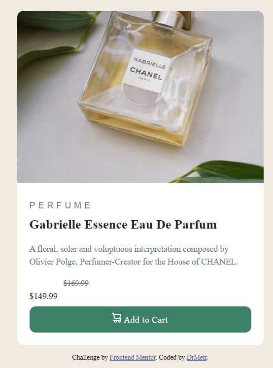

# Frontend Mentor - Product preview card component solution

This is a solution to the [Product preview card component challenge on Frontend Mentor](https://www.frontendmentor.io/challenges/product-preview-card-component-GO7UmttRfa). Frontend Mentor challenges help you improve your coding skills by building realistic projects. 

## Table of contents

- [Overview](#overview)
  - [The challenge](#the-challenge)
  - [Screenshot](#screenshot)
  - [Links](#links)
- [My process](#my-process)
  - [Built with](#built-with)
  - [What I learned](#what-i-learned)
  - [Continued development](#continued-development)
  - [Useful resources](#useful-resources)
- [Author](#author)

## Overview

### The challenge

Users should be able to:

- View the optimal layout depending on their device's screen size
- See hover and focus states for interactive elements

### Screenshot

### Links

- Solution URL: [Solution](https://github.com/DrMetr/Parfum-Sass))
- Live Site URL: [Live site]([https://your-live-site-url.com](https://drmetr.github.io/Parfum-Sass/))

## My process

### Built with

- Semantic HTML5 markup
- CSS custom properties
- Flexbox
- CSS Grid
- Mobile-first workflow
- [Sass](https://sass-lang.com/) - Dart Sass

### What I learned

I solved this challenge using pure css first (the oldstyle.css file) and then on its base I made a separate .scss file just to get used to the syntaxis. I learned how to implement Sass into VS Code, how to make mixins, how to import properties from another file and some other basic Sass stuff. I didn't encounter any new problems this time. 

### Continued development

I believe, this project is too small and easy for Sass to be applied for a reason other than training. I will continue applying it in further projects and try to use more of Sass diverse functions regardless of how justified it'd be.

### Useful resources

- [W3Schools Sass tutorial](https://www.w3schools.com/sass/default.php) - This helped me getting acquinted with Sass.
- [How to Use Sass with CSS](https://www.freecodecamp.org/news/how-to-use-sass-with-css/) - This article helped me installing Sass into VS Code.
- [Установка SCSS (SASS) на Windows 10](https://tretyakov.net/post/ustanovka-scss-sass-windows-10/#:~:text=%D0%9F%D0%BE%D0%B8%D1%81%D0%BA%D0%B0%D0%B2%20%D0%B2%20%D0%B8%D0%BD%D1%82%D0%B5%D1%80%D0%BD%D0%B5%D1%82%D0%B5%20%D0%BF%D0%BE%D0%BD%D1%8F%D0%BB%2C%20%D1%87%D1%82%D0%BE,%D1%80%D0%B5%D1%88%D0%B5%D0%BD%D0%B8%D0%B5%20%D1%8D%D1%82%D0%BE%20%D1%83%D1%81%D1%82%D0%B0%D0%BD%D0%BE%D0%B2%D0%B8%D1%82%D1%8C%20Dart%20Sass.&text=%D0%92%20%D0%BE%D1%82%D0%BA%D1%80%D1%8B%D0%B2%D1%88%D0%B8%D0%BC%D1%81%D1%8F%20%D0%BE%D0%BA%D0%BD%D0%B5%20%D0%B2%D1%8B%D0%B1%D0%B8%D0%B2%D0%B0%D0%B5%D0%BC%20%C2%AB%D0%9F%D0%B0%D1%80%D0%B0%D0%BC%D0%B5%D1%82%D1%80%D1%8B,%D1%8D%D1%82%D0%BE%20C%3A%5Cdart%2Dsass%20.) - This helped me install Sass and change Path environment variable in order to be able to use the preprocessor (the article is in rusian).

## Author

- Website - [DrMetr](https://github.com/DrMetr)
- Frontend Mentor - [@DrMetr](https://www.frontendmentor.io/profile/DrMetr)
